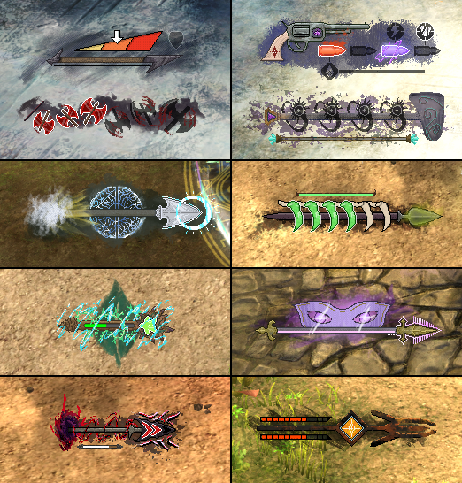

# Enlightened Armory

Reffect pack for Guild Wars 2. Requires https://github.com/Zerthox/gw2-reffect.

Dedicated Weapon UI to help more clearly see mechanics of the more recently-added weapons. Each weapon is designed to fit in roughly the same space, although Thief and Elementalist both have more than one weapon that may be shown at a time depending on equipped weapon sets.

Zip archive is available under Releases.

## Supported Weapons

- **Elementalist Hammer**: circular projectiles
- **Elementalist Pistol**: elemental bullets, secondary effects
- **Mesmer Spear**: clarity, Mirage sharp edges ambush (+25% damage)
- **Necromancer Spear**: soul shards
- **Engineer Spear**: focus, lightning rod charges
- **Ranger Mace**: nature's strength, force of nature, tapped out
- **Thief Axe**: spinning axe count
- **Thief Spear**: combo indicator, distracting throw (+10% damage) duration, shadow veil count
- **Guardian Spear**: illuminated, symbol of luminance
- **Revenant Spear**: crushing abyss stacks

## Preview

